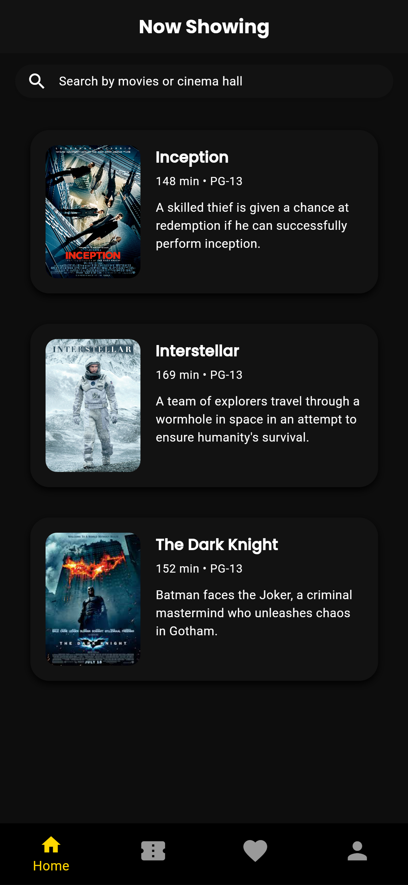
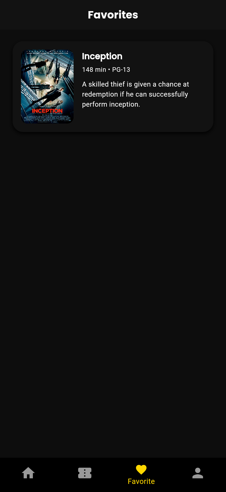
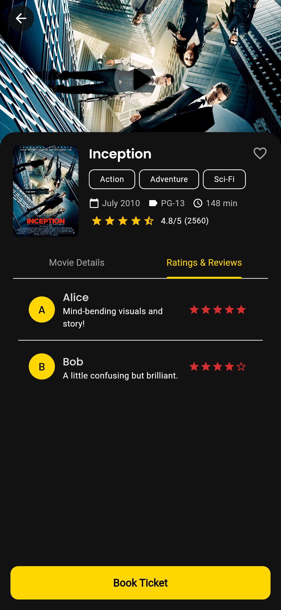
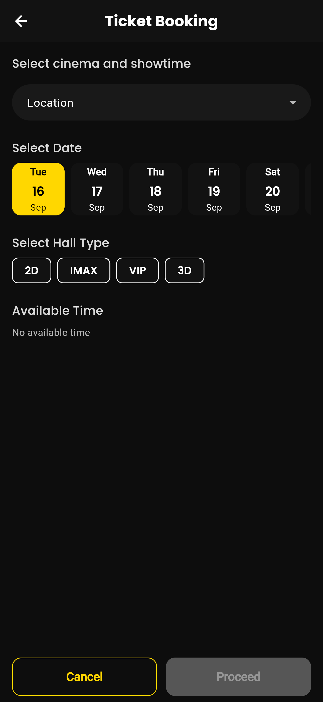
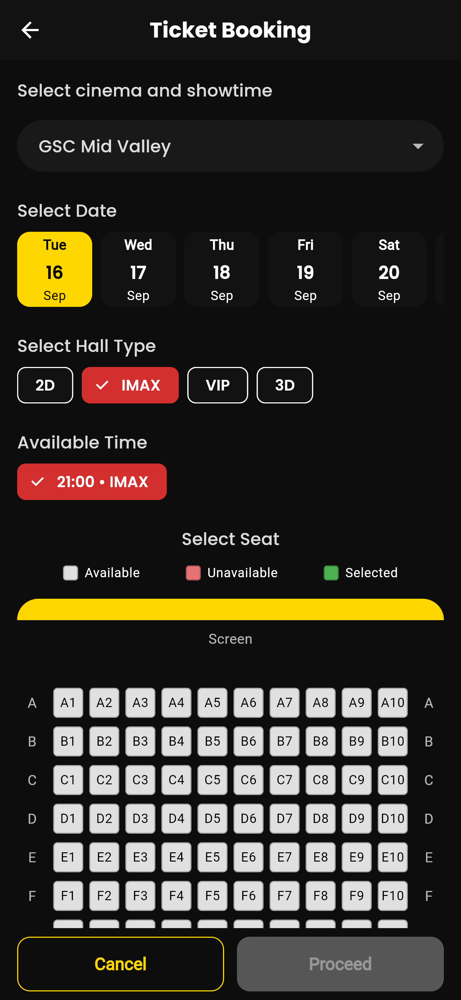
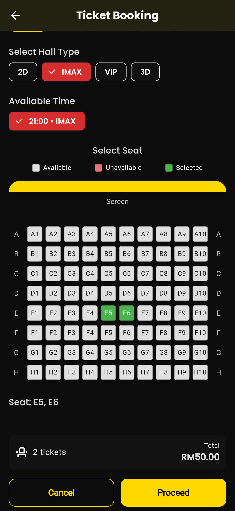
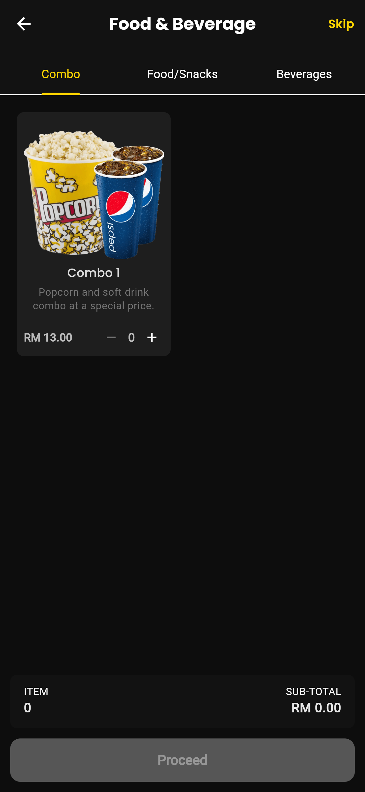
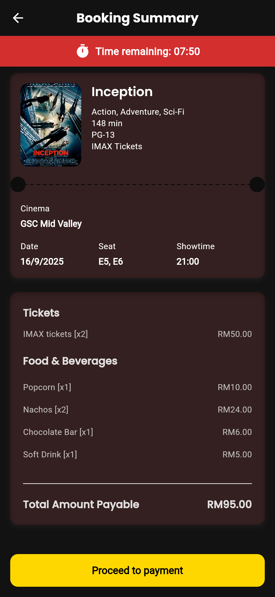
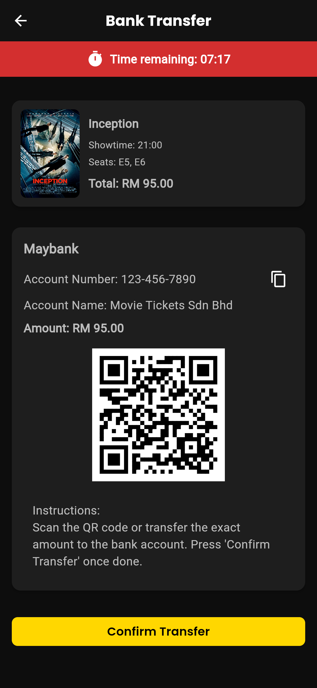
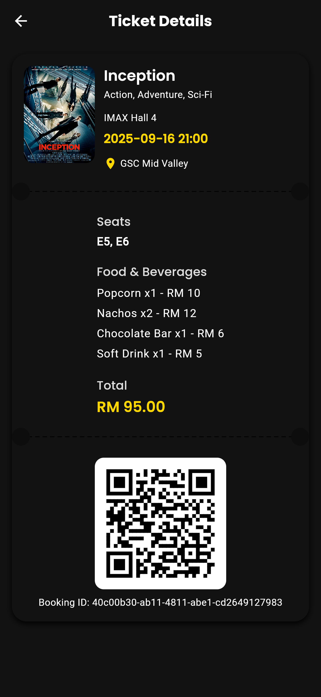

🎬 Demo Cinema Booking App by Amir Ridwan
=====================

A demo Flutter application for booking cinema tickets with **real-time seat selection** powered by WebSockets.\
This project demonstrates a full booking flow including select movie, seat locking, food & beverage selection, booking summary, and cancellation handling.

* * * * *

✨ Features
----------

-   🏠 Main Screen with 4 tabs: Home, My Tickets, Favorites, Profile

-   🎟️ Real-time Seat Selection

    -   Live updates across devices using WebSocket

    -   Seat locking/unlocking to prevent double booking

-   🍿 Food & Beverage Selection

    -   Choose snacks & drinks before checkout

-   📄 Booking Summary

    -   Review tickets, seats, and food

    -   Confirm or cancel booking (with confirmation dialog)

-   ⏱️ Booking Timer

    -   Timer starts after seat selection

    -   Auto-cancel booking when timer expires → returns user to Home

-   ⚡ WebSocket Auto Reconnect

    -   Works seamlessly on Android Emulator (`10.0.2.2`) and real devices

    -   Fallback to `localhost` for web/desktop

* * * * *

⚙️ Setup
--------

### 1\. Ensure you are in the project folder

```
cd cinema-booking-app

```

### 2\. Install dependencies

```
flutter pub get

```

* * * * *

🖥️ Running the WebSocket Server
--------------------------------

The app uses a WebSocket server for **real-time seat locking/unlocking**. A sample server is included in the `/server` folder.

### Steps to Run:

1.  Open a terminal and navigate to the `server` folder:

```
cd server

```

1.  Install dependencies (Node.js required):

```
npm install

```

1.  Start the WebSocket server:

```
node server.js

```

1.  Ensure the server URL matches your environment:

-   Android Emulator: `ws://10.0.2.2:8080`

-   Web/Desktop: `ws://localhost:8080`

-   Real Device: `ws://<your-ip>:8080` (device must be on the same WiFi network)

Once the server is running, launch the app and test **real-time seat selection**. The app will automatically connect and handle live updates.

* * * * *

🛠️ Tech Stack
--------------

-   Flutter (UI, State Management with Provider)

-   WebSocket (real-time seat updates)

* * * * * 

📸 Screenshots
--------------

### 🏠 Main Screen
<p>
  
  
  
  
  
  
</p>

### 🎫 Movie Details
<p>
  
  
</p>

### 🎟️ Ticket Booking
<p>
  
  
  
  
</p>

### 🍿 Food & Beverage
<p>
  
  
</p>

### 📄 Booking Summary


### 💳 Payment
<p>
  
  
  
  
  
  
</p>
