🎬 Demo Cinema Booking App by Amir Ridwan
=====================

A demo Flutter application for booking cinema tickets with **real-time seat selection** powered by WebSockets and a **Node.js backend**.  

This project demonstrates a complete booking flow:  
- Browse movies (served from a REST API)  
- Lock/unlock seats in real-time across devices  
- Select food & beverages before checkout  
- Review booking summary with auto-cancel timer  
- Securely confirm or cancel booking  

> 💡 The included `/server` folder contains a Node.js backend that provides **REST API** (movies & F&B) and **WebSocket server** (seat locking).

* * * * *

✨ Features
----------

-   🏠 Main Screen with 4 tabs: Home, My Tickets, Favorites, Profile

-   🎟️ Real-time Seat Selection
    -   Live updates across devices using WebSocket
    -   Seat locking/unlocking to prevent double booking

-   🍿 Food & Beverage Selection
    -   Choose snacks & drinks before checkout

-   📄 Booking Summary
    -   Review tickets, seats, and food
    -   Confirm or cancel booking (with confirmation dialog)

-   ⏱️ Booking Timer
    -   Timer starts after seat selection
    -   Auto-cancel booking when timer expires → returns user to Home

-   ⚡ WebSocket Auto Reconnect
    -   Works seamlessly on Android Emulator (`10.0.2.2`) and real devices
    -   Fallback to `localhost` for web/desktop

-   🌐 Node.js Backend
    -   REST API for movies & food
    -   WebSocket server for live seat state

* * * * *

⚙️ Setup
--------

### 1\. Ensure you are in the project folder

```
cd cinema_booking_app

```

### 2\. Install dependencies

```
flutter pub get

```

### 3\. Run the app

```
flutter run

```

* * * * *

## 🖥️ Running the WebSocket + REST API Server

The app relies on a Node.js server for:

* **Real-time seat locking/unlocking** via WebSockets
* **Movies & F\&B data** served via a REST API

A sample server is included in the `/server` folder.

### Steps to Run

1. **Navigate to the server folder**

   ```bash
   cd server
   ```

2. **Install dependencies** (requires [Node.js](https://nodejs.org/)):

   ```bash
   npm install
   ```

3. **Start the server**

   ```bash
   node server.js
   ```

4. **Verify the endpoints**

   * REST API: [http://localhost:3000/movies](http://localhost:3000/movies)
   * WebSocket: `ws://localhost:3000`

---

### 🔌 Connection Settings

Depending on where you run the app, the WebSocket/REST URL changes:

* **Android Emulator** → `10.0.2.2`

  ```
  http://10.0.2.2:3000
  ws://10.0.2.2:3000
  ```

* **iOS Simulator / macOS** → `localhost`

  ```
  http://localhost:3000
  ws://localhost:3000
  ```

* **Real Device (same WiFi as your PC)** → use your LAN IP

  ```
  http://<your-ip>:3000
  ws://<your-ip>:3000
  ```

You can find your LAN IP with:

```bash
ipconfig    # on Windows
ifconfig    # on macOS/Linux
```

---

### ✅ Next Steps

Once the server is running, launch the app:

* The REST API will serve movies & F\&B data
* The WebSocket server will handle **live seat updates** in real time

* * * * * 

🛠️ Tech Stack
--------------

-   Flutter (UI, State Management with Provider)

-   WebSocket (real-time seat updates)

* * * * * 

📸 Screenshots
--------------

### 🏠 Main Screen
<p>
  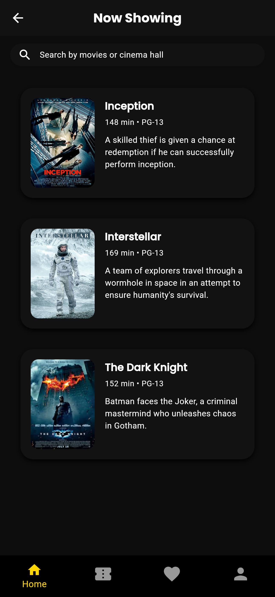
  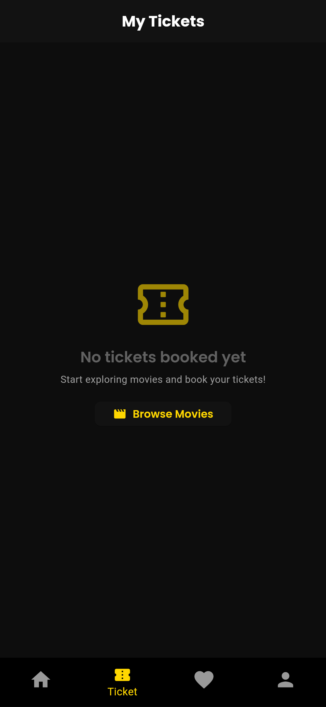
  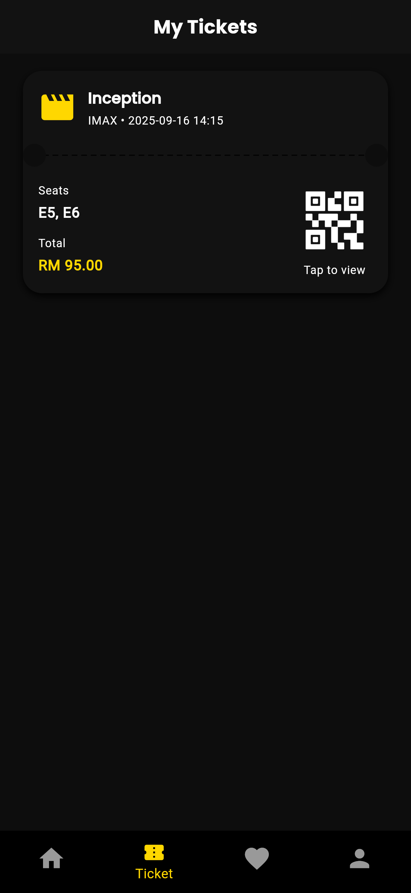
  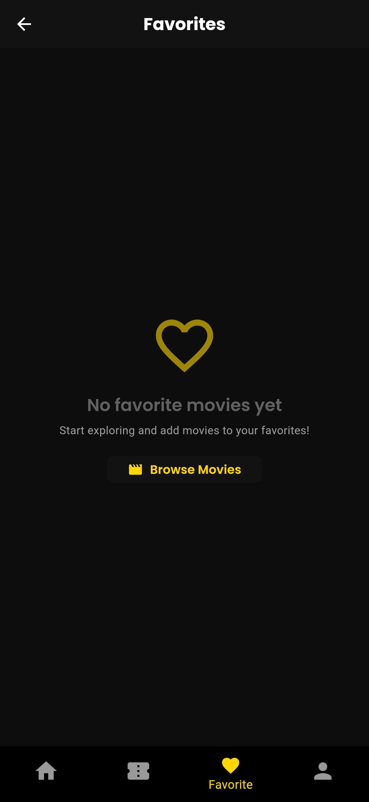
  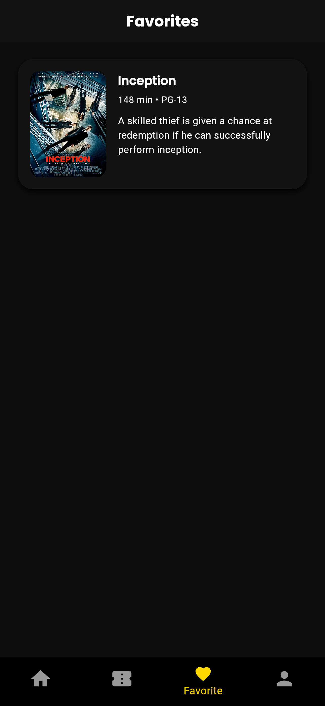
  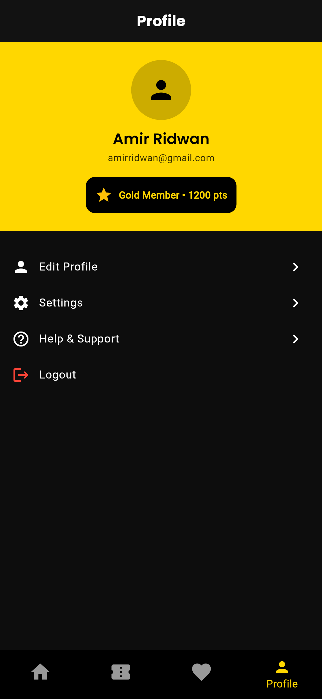
</p>

### 🎫 Movie Details
<p>
  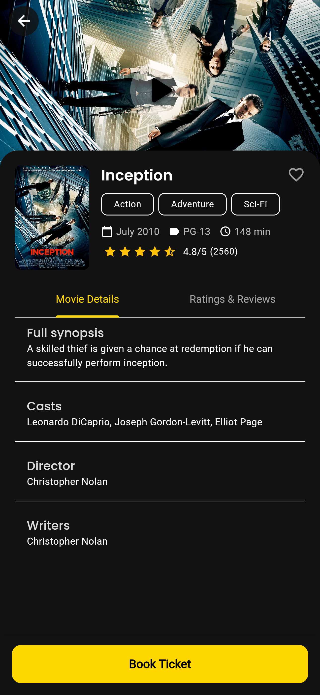
  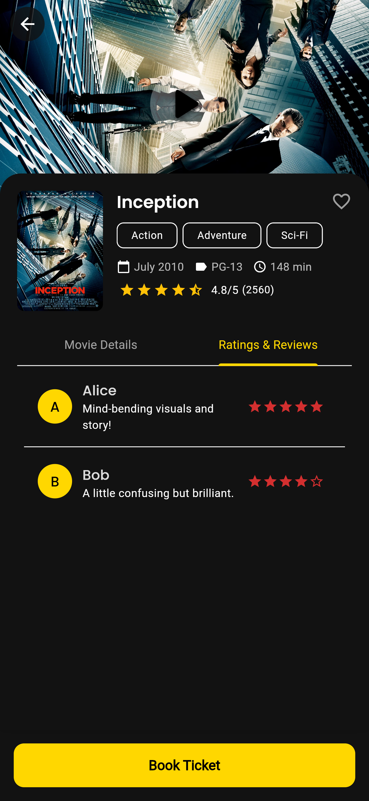
</p>

### 🎟️ Ticket Booking
<p>
  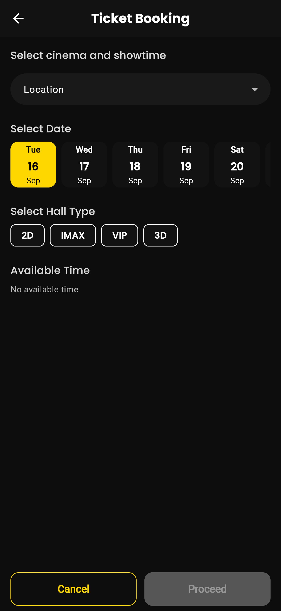
  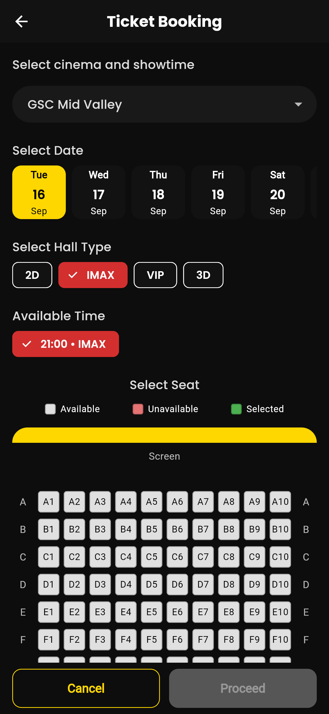
  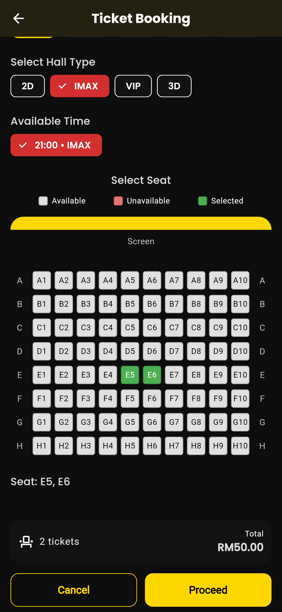
  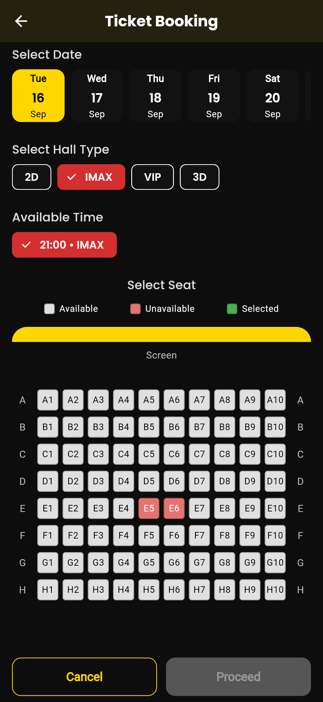
</p>

### 🍿 Food & Beverage
<p>
  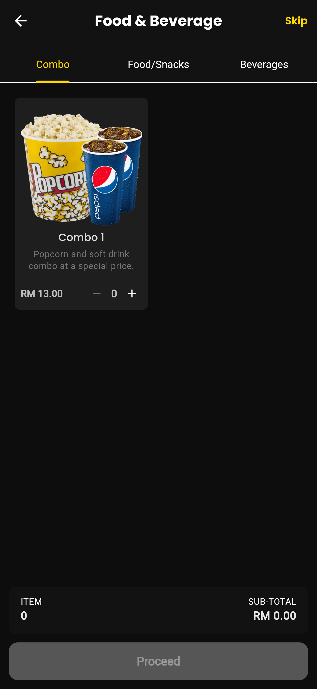
  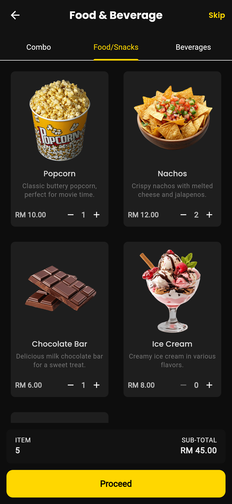
</p>

### 📄 Booking Summary


### 💳 Payment
<p>
  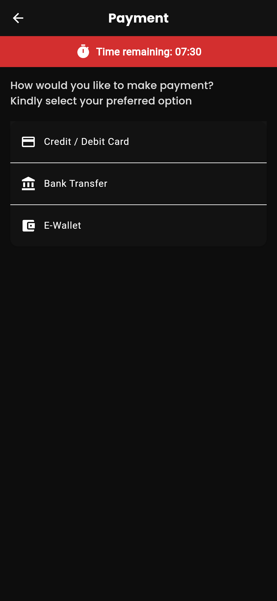
  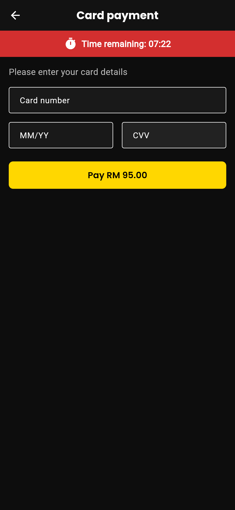
  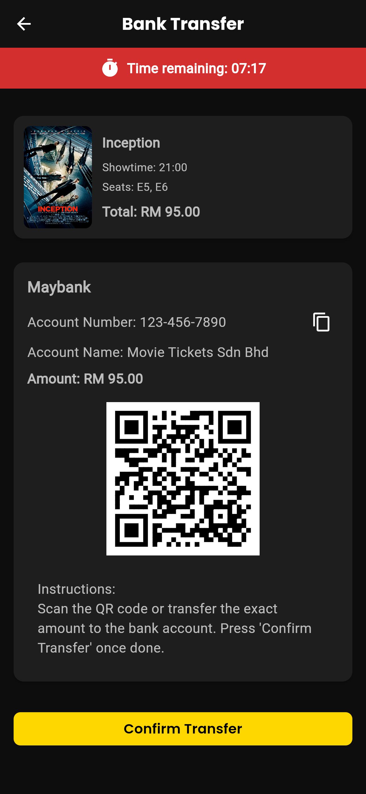
  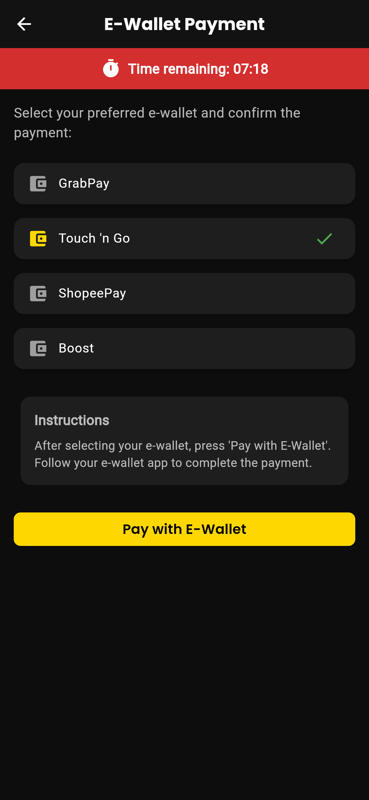
  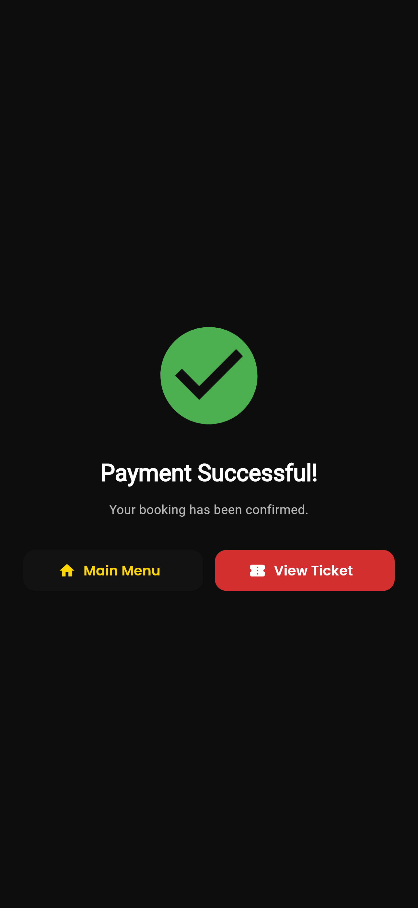
  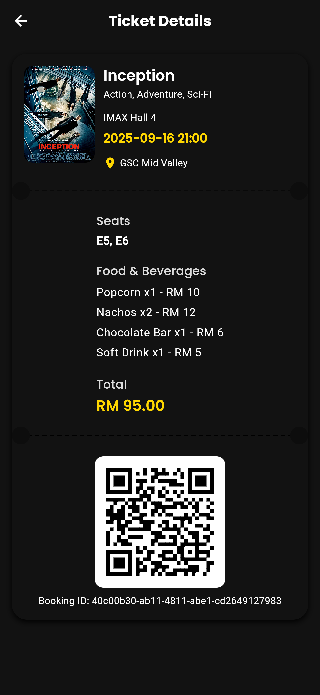
</p>
